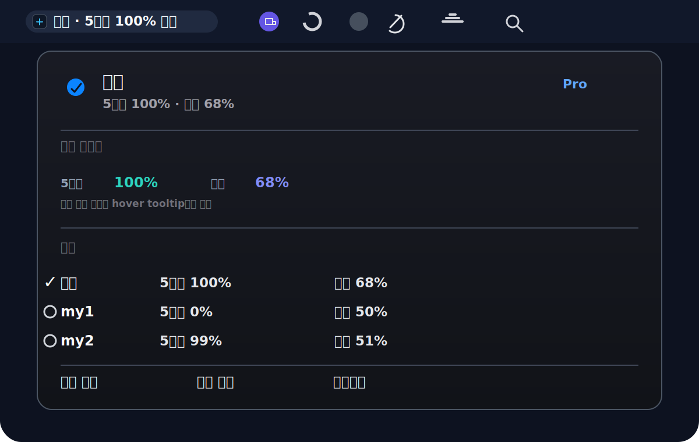

# KLIC Codex Switcher

<p align="center">
  <strong>macOS 메뉴바에서 OpenAI Codex 계정을 빠르게 전환하고, 남은 사용량까지 바로 확인하세요.</strong>
</p>

<p align="center">
  
  
  
  
  
</p>

<p align="center">
  
</p>

<p align="center">
  <a href="#-설치">설치</a> ·
  <a href="#-주요-기능">주요 기능</a> ·
  <a href="#-사용법">사용법</a> ·
  <a href="#-cli">CLI</a>
</p>

---

## 왜 필요한가요?

회사 계정, 개인 계정, 팀 계정을 번갈아 쓰다 보면 Codex 계정 전환은 꽤 번거롭습니다. 매번 로그아웃하고 다시 로그인하거나, 어떤 계정의 5시간 사용량이 남았는지 확인하느라 흐름이 끊깁니다.

**KLIC Codex Switcher**는 그 작업을 macOS 메뉴바 한 곳으로 모읍니다.

- 닉네임 기반 계정 목록으로 원문 계정 ID를 숨깁니다.
- 5시간 / 주간 남은 사용량을 계정별로 보여줍니다.
- 클릭 한 번으로 CLI와 Codex 앱의 계정 반영 범위를 제어합니다.
- 상세 리셋 시간은 hover tooltip에서 확인할 수 있어 메뉴가 과하게 넓어지지 않습니다.

---

## 주요 기능

| 기능 | 설명 |
|---|---|
| 빠른 계정 전환 | 메뉴바에서 계정을 선택하면 `~/.codex/auth.json`을 새 계정으로 교체합니다. |
| Codex 앱 반영 | 실행 중인 Codex 앱을 재시작해 전환한 계정을 즉시 반영할 수 있습니다. |
| 계정별 사용량 | 활성 계정뿐 아니라 다른 저장 계정의 5시간 / 주간 잔여량도 같이 봅니다. |
| 닉네임 표시 | `회사`, `개인`, `my1`처럼 짧은 이름으로 계정을 구분합니다. |
| 전환 범위 설정 | CLI 다음 실행 적용, Codex 앱 즉시 반영, 앱 자동 실행을 각각 켜고 끕니다. |
| 네이티브 OAuth | 외부 `codex-auth` 의존 없이 OAuth 2.0 PKCE 흐름을 앱 안에서 처리합니다. |
| 설치앱 제공 | 터미널 없이 더블클릭 설치 가능한 설치 앱을 빌드할 수 있습니다. |

---

## 설치

### 1. 저장소 받기

```bash
git clone https://github.com/klic-co-kr/KLIC-Codex-Switch.git
cd KLIC-Codex-Switch
```

### 2. 메뉴바 앱 빌드

```bash
./build.sh
```

빌드 결과:

```text
build/Codex Account Switcher.app
```

### 3. 현재 사용자 계정에 설치

```bash
./install.sh
```

설치 결과:

- 앱: `~/Applications/Codex Account Switcher.app`
- 자동 실행: `~/Library/LaunchAgents/local.codex-account-switcher.menu-bar.plist`
- 로그: `~/Library/Logs/CodexAccountSwitcher.log`

### 더블클릭 설치앱 만들기

```bash
./build-installer.sh
open "build/Codex Account Switcher Installer.app"
```

---

## 사용법

### 계정 추가

1. 메뉴바의 Codex Account Switcher를 엽니다.
2. **계정 추가...** 또는 **기기 코드로 계정 추가...**를 선택합니다.
3. OpenAI 로그인 완료 후 계정이 목록에 추가됩니다.

### 계정 전환

1. 메뉴바를 엽니다.
2. 원하는 닉네임의 계정을 클릭합니다.
3. 설정된 전환 범위에 따라 CLI / Codex 앱에 반영됩니다.

### 닉네임 설정

메뉴의 **계정 표시 이름**에서 계정별 표시 이름을 바꿀 수 있습니다.

추천 예시:

```text
회사
개인
팀
my1
🚀
```

### 전환 적용 범위

| 옵션 | 설명 |
|---|---|
| CLI 다음 실행 | 다음 `codex` 실행부터 선택한 계정을 사용합니다. |
| Codex 앱 반영 | Codex 앱이 실행 중이면 재시작해 즉시 반영합니다. |
| 꺼져 있으면 실행 | Codex 앱이 꺼져 있어도 전환 후 자동 실행합니다. |

---

## CLI

앱 번들은 메뉴바 앱이지만, 내부 실행 파일은 CLI 명령도 지원합니다.

```bash
# 계정 목록
./run.sh -- list

# 활성 계정
./run.sh -- active

# 사용량 확인
./run.sh -- usage

# 계정 전환
./run.sh -- switch <key 또는 email>

# 자동 전환 상태
./run.sh -- rotation status

# 전환 범위 상태
./run.sh -- scope status
```

---

## 개발

```bash
# 빌드 없이 실행
./run.sh

# 메뉴바 앱 빌드
./build.sh

# 설치앱 빌드
./build-installer.sh
```

### 테스트

```bash
bash tests/menu_bar_visibility_test.sh
bash tests/menu_style_test.sh
bash tests/account_usage_rows_test.sh
bash tests/status_line_test.sh
bash tests/switch_scope_test.sh
bash tests/package_artifacts_test.sh
bash tests/install_launch_agent_test.sh
```

### 기술 스택

- Swift 5.9+
- AppKit
- WebKit
- OAuth 2.0 PKCE
- LaunchAgent
- 외부 런타임 의존성 없음

---

## 프로젝트 구조

```text
KLIC-Codex-Switcher/
├── Installer/
│   └── main.swift
├── Sources/
│   └── main.swift
├── Resources/
│   ├── AppIconSource.png
│   ├── en.lproj/
│   └── ko.lproj/
├── docs/
│   └── assets/
│       └── klic-codex-switcher-menu-preview.svg
├── tests/
├── build-installer.sh
├── build.sh
├── install.sh
└── run.sh
```

---

## FAQ

**비밀번호를 저장하나요?**

아니요. 브라우저/OAuth 흐름을 통해 받은 토큰만 로컬에 저장합니다.

**Codex CLI도 같이 바뀌나요?**

네. 기본 설정에서는 CLI 다음 실행과 Codex 앱 반영을 함께 처리합니다.

**Codex 앱이 꺼져 있으면 어떻게 되나요?**

메뉴에서 **꺼져 있으면 실행**을 켜면 전환 후 Codex 앱을 자동 실행합니다.

**계정 ID가 메뉴에 그대로 보이나요?**

아니요. 메뉴 UI는 닉네임 중심으로 표시하고, 세부 정보는 필요한 곳에서만 tooltip으로 확인합니다.

---

## License

[MIT](LICENSE)
